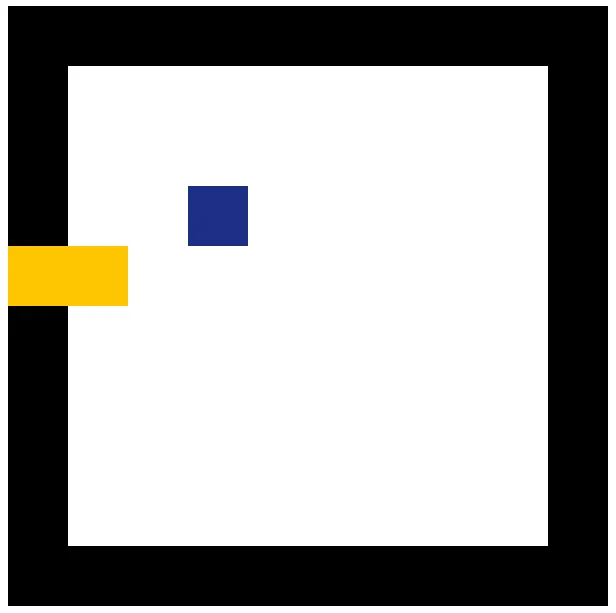
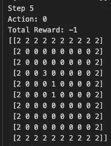

# RL Snake game

AI agent for a snake game using reinforcement learning with [Proximal Policy Optimization (PPO)](https://stable-baselines3.readthedocs.io/en/master/modules/ppo.html#ppo). The environment is built using [Gymnasium](https://gymnasium.farama.org/), and the model is trained using [Stable-Baselines3](https://stable-baselines3.readthedocs.io/en/master/).

<br>

## Training Progress Over Time
note: hyperparameters were adjusted throughout the process for learning stability and performance. 
<br>
| 1 hour | 5 hours | 10 hours | 24 hours |
| --- | --- | --- | --- |
|  |  |  |  |

<br>

## Installation

Clone the repo & install the requirements:

```bash
git clone https://github.com/slynj/RL-snake-game.git
cd RL-snake-game
pip install -r requirements.txt
```

<br>

## Render Mode

```bash
render(mode='rgb_array')
render(mode='console')
```

Render mode is set default to `rgb_array` for graphics & to save the `.gif` file. Otherwise set to `console` to print the grid in the console.

| **`rgb_array`** | **`console`** |
| --- | --- |
|  |  |


<br>

## State & Action Space

The game is based on a 10x10 grid. 3 features are passed as a state:

- `position` : head coord of the snake
- `direction` : dydx of the snake ( [1, 0], [0, 1], [-1, 0], [0, -1] )
- `gird` : status for each cell of the grid ( EMPTY, SNAKE, FOOD, WALL )

Possible actions for the agent:

- `LEFT` [0]
- `STRAIGHT` [1]
- `RIGHT` [2]

<br>

## Reward System

| **Action** | **Reward** |
| --- | --- |
| Eating Food | +50 |
| Moving Towards Food | +1 |
| Moving Away from Food | -1 |
| Hitting the Wall / Snake Body | -20 |

<br>

## Logs / Best Model

Model performance is logged in the `log/` directory. Includes evaluation metrics:

- Total reward per episode
- Episode length (# actions taken until done)
- How often food was collected

Best models are saved under `best_model/`. If the model exists under the directory, training starts with the parameters from that model.
